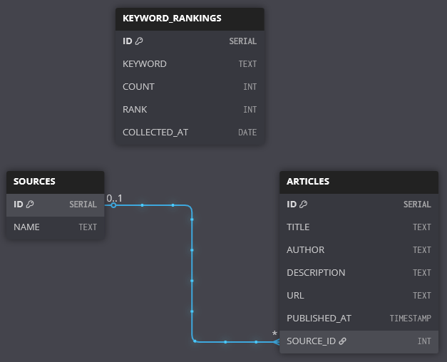

# 🧠 METHODOLOGY
## 📌 Project Overview

This project is a daily news keyword ranking pipeline built with Python, PostgreSQL, and NewsAPI. Its purpose is to:

- Fetch news articles from the previous day on a chosen topic (e.g. “climate”)

- Store articles and metadata in a PostgreSQL database

- Extract and rank top keywords from article titles using basic NLP techniques

- Visualise these top keywords as a daily bar chart

- Enable further analysis or automation through structured SQL and text data

This project simulates the kind of backend pipeline you might use in journalism tech, media monitoring, or trend analysis.

## 📆 Timeline

### ✅ v0.1: Initial Setup
- [x] Register with NewsAPI and obtain API key
- [x] Test basic API calls to fetch `everything`

### 🔄 v0.2: Daily Fetching + Storage
- [x] Design normalised schema (articles, sources, keywords)
- [x] Create tables in PostgreSQL using SQL
- [x] Write Python script to fetch and insert daily stories
- [x] Output a daily bar chart of most common keywords
- [x] Setup Windows Task Scheduling for daily automatic runs

### 📊 v0.3: Analysis
- [x] Use DBeaver to query tables
- [x] Add NLP tagging

## 🛠 Pipeline Architecture

The pipeline follows a modular structure:

1. `fetch_news.py`

    - Connects to the NewsAPI everything endpoint

    - Fetches articles matching one or more topics from the previous day

    - Handles deduplication and batching

2. `db_utils.py`

    - Manages database connections using psycopg2

    - Handles insertion of article data, sources, and keyword rankings into PostgreSQL

3. `keyword_extractor.py`

    - Cleans article titles

    - Removes common stopwords and source names

    - Extracts and ranks most frequent keywords using collections.Counter

4. `daily_keyword_pipeline.py`

    - Orchestrates all parts of the pipeline: fetching, saving, processing, visualising

    - Use to create `run_pipeline.bat` that can be scheduled to run daily using Windows Task Scheduler

5. `visualise_keywords.py`
    
    - Connects to the database

    - Fetches the top keywords for the previous day

    - Plots and saves a bar chart using matplotlib

## 🧩 Database Design and SQL Query Development

As part of the project, a relational schema was created to support:

- ✅ Normalised storage of sources, articles, and keyword_rankings

- ✅ Time-based analysis using collected_at timestamps

- ✅ Flexibility for future expansion (e.g. topic support, many-to-many keyword relationships)

Here's the Entity Relationship Diagram for the basic database schema:

SQL was developed iteratively during testing in both pgAdmin and DBeaver. Common queries include:

- Counting article volumes over time

- Listing top keywords on a given date

- Joining articles with sources and their associated keyword rankings

Queries were tested using live data pulled from NewsAPI, and refined to suit the structure and flow of the pipeline.

## 🧠 NLP Tagging with spaCy

As an extension to simple keyword counting, a proof-of-concept NLP tagging module `nlp_tagging_keywords.py` was developed using the spaCy library. This included:

- **POS (Part-of-Speech) Tagging**

    - Used to selectively include only nouns and proper nouns in keyword extraction

    - Improves keyword relevance by filtering verbs, prepositions, etc.

- **NER (Named Entity Recognition)**

    - Used to extract mentions of people, places, and organizations from article titles and descriptions

    - Enables future analysis like "Top mentioned organizations per day"

These NLP steps were applied via a Python script that:

- Loads a CSV export of the articles table (via DBeaver)

- Processes each row using spaCy’s en_core_web_trf model

- Outputs enriched data for further analysis or visual inspection

## 🔍 Data Sources
- [NewsAPI.org](https://newsapi.org/)

---

## 🛠 Tools Used
- Python (requests, nltk, psycopg2, matplotlib, spaCy)
- PostgreSQL + pgAdmin
- DBeaver
- VSCode

## 🧭 Reflections and Next Steps

This project began with a basic goal — extract and rank keywords from news — but evolved into a modular, automatable pipeline capable of supporting:

- Historical trend tracking

- Deeper text analysis (via NER and POS)

- Basic visualisation

Possible future improvements:

- Introduce many-to-many keyword/article relationships

- Expand to multilingual news data

- Instead of custom stopwords, filter keywords out by their NLP tags